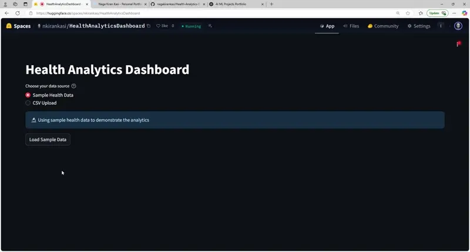

# Health Analytics Dashboard

## Overview
The **Personal Health Analytics Dashboard** is a simple web application that allows users to upload their health data (in CSV or Excel format) and predicts **whether they will lose or gain weight**, along with an estimate of the weight change in pounds. The app leverages **Streamlit** for an interactive front-end and employs **basic linear regression ML models** to provide predictions.

## Features
- 📂 **Upload Health Data**: Users can upload CSV/Excel files containing health data.
- 📊 **Data Visualization**: Displays trends for sleep, step count, exercise minutes, and heart rate.
- 🔍 **Weight Prediction**: Uses a simple **linear regression model** to predict weight change.
- ⚡ **Streamlit UI**: A minimalistic and intuitive interface for user interaction.
- ☁️ **Deployment Ready**: Can be deployed on **Streamlit Sharing, AWS, or Hugging Face Spaces**.

## Tech Stack
- **Frontend:** Streamlit
- **Backend:** Python, Pandas
- **Machine Learning:** Scikit-learn (Linear Regression)
- **Data Handling:** Pandas, NumPy

## Installation
### Prerequisites
Ensure you have **Python 3.8+** installed.

### Steps to Run Locally
1. **Clone the repository**:
   ```bash
   git clone https://github.com/nagakirankasi/Health-Analytics-Dashboard.git
   cd Personal-Health-Dashboard
   ```

2. **Create a virtual environment** (optional but recommended):
   ```bash
   python -m venv venv
   source venv/bin/activate  # On Windows, use 'venv\Scripts\activate'
   ```

3. **Install dependencies**:
   ```bash
   pip install -r requirements.txt
   ```

4. **Run the Streamlit app**:
   ```bash
   streamlit run app.py
   ```

## Usage
1. **Upload your health data** in CSV or Excel format.
2. The app will process the data and display **visualizations** for:
   - Sleep patterns
   - Step count trends
   - Exercise minutes
   - Heart rate changes
3. The ML model will predict:
   - **Weight change** (gain/loss) in pounds over the next month.
4. The results will be displayed with an **interactive dashboard**.

## Model Details
- **Algorithm Used:** Linear Regression
- **Features:** Sleep Hours, Steps, Exercise Minutes, Heart Rate
- **Target Variable:** Weight Change (in lbs)
- **Training Dataset:** Public health datasets + synthetic data

## Demo
https://huggingface.co/spaces/nkirankasi/HealthAnalyticsDashboard



## Deployment
The app can be deployed using:
- **Streamlit Community Cloud**
- **AWS Lambda**
- **Hugging Face Spaces**

## Contributing
Feel free to open **issues** or submit **pull requests** if you'd like to contribute!

## License
This project is licensed under the MIT License.

## Contact
